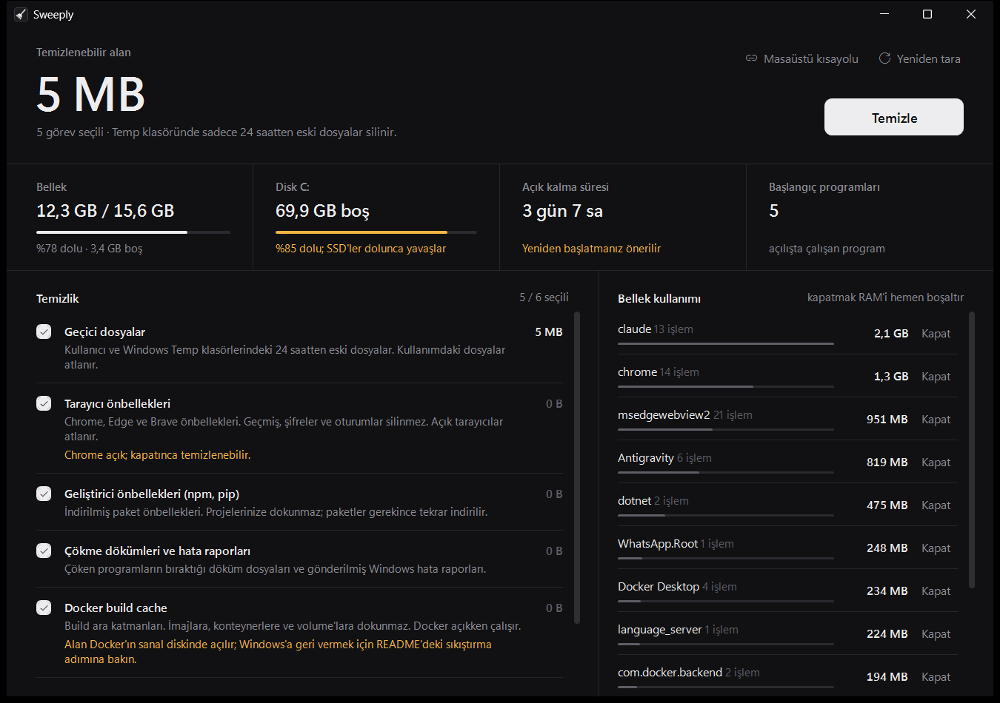

<p align="center">
  
</p>

<h1 align="center">Sweeply</h1>

<p align="center">Tek tıkla, <b>güvenli</b> Windows temizliği ve RAM takibi.</p>

<p align="center">
  
</p>

## Neden bir tane daha "optimizasyon" aracı?

Çoğu "RAM temizleyici", programların belleğini zorla boşaltır. Windows o verilere birkaç saniye sonra tekrar ihtiyaç duyar ve onları diskten geri okur. Sonuçta bilgisayar hızlanmaz, aksine kısa süreliğine yavaşlar.

Sweeply bunun yerine **gerçekten fark yaratan** işleri yapar:

- **Gereksiz dosyaları siler.** Silinen her şey zaten yeniden oluşturulabilir türden dosyalardır: önbellekler, geçici dosyalar, çökme dökümleri.
- **RAM'i kimin kullandığını gösterir.** Kullanmadığınız programı tek tıkla kapatabilirsiniz. Kapatmadan önce onay ister, program kaydetme sorabilsin diye önce nazikçe kapatmayı dener.
- **Sistemi yavaşlatan durumlar için uyarır:** disk dolmak üzereyse, bilgisayar günlerdir yeniden başlatılmadıysa veya açılışta çok program çalışıyorsa.

## Temizlik görevleri

| Görev | Ne yapar | Varsayılan |
|---|---|---|
| Geçici dosyalar | Kullanıcı ve Windows Temp klasörlerindeki **24 saatten eski** dosyaları siler. Kullanımdaki dosyalar atlanır. | ✅ |
| Tarayıcı önbellekleri | Chrome, Edge ve Brave'in `Cache`, `Code Cache` ve `GPUCache` klasörlerini temizler. Geçmiş, şifreler ve çerezler **silinmez**. Açık tarayıcılar atlanır. | ✅ |
| Geliştirici önbellekleri | npm (`npm cache clean --force`) ve pip önbelleklerini temizler. | ✅ |
| Çökme dökümleri | `CrashDumps` ve Windows hata raporu arşivini temizler. | ✅ |
| Docker build cache | Sadece `docker builder prune -a` çalıştırır. **İmajlara, konteynerlere ve volume'lara dokunmaz.** | ✅ |
| WSL ve Docker'ı kapat | `wsl --shutdown` ile birkaç GB RAM geri kazandırır. Çalışan konteynerler durur. | ⬜ |

Geri Dönüşüm Kutusu, İndirilenler klasörü ve kişisel dosyalar **hiçbir zaman** silinmez. Junction ve sembolik bağlantıların içine girilmez, yani temizlik hedef klasörün dışına taşamaz.

## Kurulum

**Hazır sürüm:** [Releases](../../releases) sayfasından `Sweeply.exe` dosyasını indirin. [.NET 8 Desktop Runtime](https://dotnet.microsoft.com/download/dotnet/8.0) gerekir.

**Kaynaktan kurulum** (.NET 8 SDK gerekir):

```powershell
git clone https://github.com/AlperEnesErsu/Sweeply.git
cd Sweeply
powershell -ExecutionPolicy Bypass -File install.ps1
```

Bu betik uygulamayı `%LOCALAPPDATA%\Programs\Sweeply` klasörüne kurar ve masaüstüne bir **Sweeply** kısayolu ekler.

## Kullanım

- **Masaüstü kısayolu** uygulamayı `--auto` parametresiyle açar: pencere açılır, analiz yapılır ve seçili görevler **otomatik olarak** çalışır.
- Uygulamayı normal açarsanız önce analiz sonuçlarını görürsünüz. İstediğiniz görevleri işaretleyip **Temizle** butonuna basarsınız.
- Kısayolu uygulama içinden de oluşturabilirsiniz: **Masaüstü kısayolu**.

Yönetici izni gerekmez. Yönetici yetkisi gerektiren dosyalar (ör. bazı `C:\Windows\Temp` içerikleri) sessizce atlanır. Windows'ta "Animasyon efektleri" kapalıysa uygulamadaki animasyonlar da kapanır.

## İpucu: Docker'ın kapladığı alanı Windows'a geri vermek

Docker build cache'i silindiğinde alan Docker'ın sanal diski (`docker_data.vhdx`) içinde boşalır, ama dosyanın kendisi küçülmez. Alanı Windows'a geri vermek için:

1. Docker Desktop'tan çıkın (**Quit Docker Desktop**).
2. **Yönetici olarak** bir terminal açıp şunları çalıştırın:

```powershell
wsl --shutdown
diskpart
```

```text
select vdisk file="C:\Users\<kullanıcı>\AppData\Local\Docker\wsl\disk\docker_data.vhdx"
attach vdisk readonly
compact vdisk
detach vdisk
exit
```

## Geliştirme

```powershell
dotnet build Sweeply.sln
dotnet test Sweeply.sln
dotnet run --project src/Sweeply
```

Testler dosya silme algoritmalarını her seferinde yeni oluşturulan geçici klasörlerde dener. Kapsanan senaryolar:
- Yaş filtresi
- Kullanımdaki ve salt okunur dosyalar
- Boşalan klasörlerin kaldırılması
- Junction'ların takip edilmemesi
- Tarayıcı geçmişi, şifre ve çerez dosyalarının korunması
- Açık tarayıcıların atlanması
- Docker çıktılarının ayrıştırılması
- İşlem gruplama
- Komut zaman aşımı

Yeni bir temizlik görevi eklemek için `src/Sweeply/Tasks` altında `ICleanupTask` arayüzünü uygulayan bir sınıf yazın ve `MainWindow.xaml.cs` içindeki listeye ekleyin. Uygulama ikonu `tools/make-icon.ps1` ile üretilir.

## Lisans

[MIT](LICENSE)
